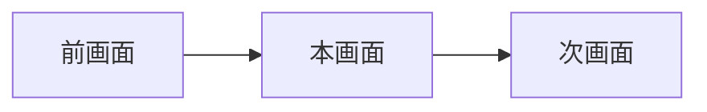

# 画面設計書テンプレート

> 本ファイルはコピー用テンプレートです。画面ごとに `docs/design/<画面ID>.md` を作成し、各セクションを埋めてください。  
> **プロダクト方針（リリース優先・MVP スコープ）:** [`docs/PRODUCT_POLICY.md`](../PRODUCT_POLICY.md)

---

## 1. ドキュメント情報

| 項目 | 内容 |
|------|------|
| 画面ID | `（例: title / play）` |
| 画面名 | `（例: タイトル画面）` |
| 版 | `0.1.0` |
| 作成日 | `YYYY-MM-DD` |
| 更新日 | `YYYY-MM-DD` |
| 関連ブランチ | `（例: feature/add-title-page）` |
| 参照実装 | `（例: src/App.tsx）` |

---

## 2. 本画面のスコープ

| 区分 | 内容 |
|------|------|
| **Must（今回実装）** | |
| **Should（余力があれば）** | |
| **Won't（今回やらない）** | |

### 2.1 広告・収益（本画面）

| 項目 | 方針 |
|------|------|
| 広告枠の有無 | `あり / なし / 将来` |
| 推奨広告種別 | `バナー / インタースティシャル / リワード` |
| 表示タイミング | |
| UX上の注意 | 誤タップ・ゲーム操作阻害を避ける配置 |

---

## 3. 画面概要

### 3.1 目的

- ユーザーがこの画面で達成することを1〜2文で記述。

### 3.2 前提・制約

- 対象デバイス: スマホ Web（レスポンシブ）を主、PC は副次。
- 技術スタック: React + TypeScript + Vite。
- 既存デザイン（配色・フォント感）との整合を維持。
- **UI 共通:** [`UI_COMMON.md`](UI_COMMON.md) に従う（全画面 `AppFooter` + コピーライト Must）。

### 3.3 画面遷移



| 遷移元 | トリガー | 遷移先 |
|--------|----------|--------|
| | | |

---

## 4. UI構成

### 4.1 レイアウト（ワイヤー）

```
（ASCII ワイヤーを記載）
```

### 4.2 コンポーネント一覧

| ID | 種別 | 表示名 / ラベル | 操作 | Must |
|----|------|-----------------|------|------|
| `app-footer` | 共通 [`AppFooter`](../../src/components/AppFooter.tsx) | コピーライト | なし | ✅（全画面） |
| | | | | |

### 4.3 モーダル・オーバーレイ

| ID | 種別 | 表示条件 | 閉じ方 |
|----|------|----------|--------|
| | | | |

---

## 5. 状態・ロジック

### 5.1 画面ステート

| ステート名 | 説明 | 遷移条件 |
|------------|------|----------|
| | | |

### 5.2 ビジネスルール

- ルールを箇条書きで記載（スコア計算、入力制限など）。

### 5.3 エッジケース

| ケース | 期待動作 |
|--------|----------|
| | | |

---

## 6. データ・永続化

| データ | 保存先 | キー例 | MVP |
|--------|--------|--------|-----|
| | `localStorage` / メモリのみ | | |

---

## 7. 音声・設定

| 項目 | 仕様 | MVP |
|------|------|-----|
| BGM | | |
| SE | | |
| 設定の保存 | | |

---

## 8. 非機能要件

| 項目 | 要件 |
|------|------|
| 初回表示 | |
| パフォーマンス | |
| アクセシビリティ | ボタンは `button` 要素、タップ領域 44px 以上推奨 |
| 対応ブラウザ | モダンブラウザ（Chrome / Safari モバイル） |

---

## 9. 受け入れ条件（Acceptance Criteria）

- [ ] AC-1: 
- [ ] AC-2: 

---

## 10. 実装メモ

| 項目 | 内容 |
|------|------|
| 想定ファイル | |
| 既存流用 | |
| 依存ライブラリ | 追加なしを原則（[`PRODUCT_POLICY.md`](../PRODUCT_POLICY.md) 参照） |

---

## 11. 変更履歴

| 版 | 日付 | 変更内容 |
|----|------|----------|
| 0.1.0 | | 初版 |
