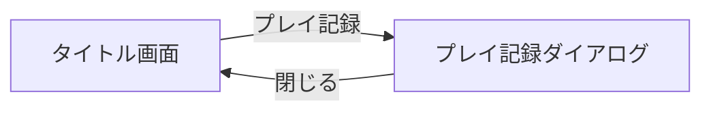

# 画面設計書：プレイ記録ダイアログ

> プロダクト方針: [`docs/PRODUCT_POLICY.md`](../PRODUCT_POLICY.md)

---

## 1. ドキュメント情報

| 項目 | 内容 |
|------|------|
| 画面ID | `play-record` |
| 画面名 | プレイ記録ダイアログ |
| 作成日 | `2026-06-15` |
| 更新日 | `2026-06-15` |
| 関連ブランチ | `main` |
| 参照実装 | `src/App.tsx`, `src/screens/TitleScreen.tsx` |

---

## 2. 本画面のスコープ

| 区分 | 内容 |
|------|------|
| **Must（今回実装）** | プレイ記録ダイアログ追加 / タイトルから表示導線追加 / 5指標の表示（ベストスコア、ベストタイム、累計獲得スコア、総プレイ回数、総プレイ時間） / 各指標の localStorage 永続化 |
| **Should（余力があれば）** | 記録のリセット確認ダイアログ（開発・検証用） |
| **Won't（今回やらない）** | 日別統計 / ランキング / クラウド同期 / ユーザーID連携 |

### 2.1 広告・収益（本画面）

| 項目 | 方針 |
|------|------|
| 広告枠の有無 | なし（MVPでは閲覧性優先） |
| 推奨広告種別 | 将来検討 |
| 表示タイミング | 将来検討 |
| UX上の注意 | 記録値の視認性を優先し、誤タップを誘発する要素を置かない |

---

## 3. 画面概要

### 3.1 目的

- ユーザーが過去プレイの成果を確認できるようにし、継続プレイ動機を作る。
- localStorage に保存された基本統計を、タイトルから1タップで閲覧できるようにする。

### 3.2 前提・制約

- 対象デバイス: スマホ Web を主、PC は副次。
- 技術スタック: React + TypeScript + Vite。
- **UI 共通:** [`UI_COMMON.md`](UI_COMMON.md) に従う（`AppFooter` + コピーライト Must）。
- 依存パッケージは追加しない（`PRODUCT_POLICY.md` 準拠）。

### 3.3 画面遷移



| 遷移元 | トリガー | 遷移先 |
|--------|----------|--------|
| タイトル画面 | プレイ記録ボタン | プレイ記録ダイアログ表示 |
| プレイ記録ダイアログ | 閉じるボタン / 外側タップ | タイトル画面 |

---

## 4. UI構成

### 4.1 レイアウト（ワイヤー）

```
┌────────────────────────────┐
│        プレイ記録           │
├────────────────────────────┤
│ ベストスコア      12345     │
│ ベストタイム      00:12     │
│ 累計獲得スコア    567890    │
│ 総プレイ回数      321       │
│ 総プレイ時間      01:23:45  │
├────────────────────────────┤
│          [ 戻る ]           │
├────────────────────────────┤
│ © 2026 A型システム          │
└────────────────────────────┘
```

### 4.2 コンポーネント一覧

| ID | 種別 | 表示名 / ラベル | 操作 | Must |
|----|------|-----------------|------|------|
| `record-title` | テキスト | プレイ記録 | なし | ✅ |
| `record-best-score` | 行 | ベストスコア | なし | ✅ |
| `record-best-time` | 行 | ベストタイム | なし | ✅ |
| `record-total-score` | 行 | 累計獲得スコア | なし | ✅ |
| `record-total-plays` | 行 | 総プレイ回数 | なし | ✅ |
| `record-total-time` | 行 | 総プレイ時間 | なし | ✅ |
| `btn-close` | ボタン | ❎ | ダイアログを閉じる | ✅ |
| `app-footer` | 共通 [`AppFooter`](../../src/components/AppFooter.tsx) | コピーライト | なし | ✅ |

### 4.3 タイトル画面側の導線変更

- タイトル画面のボタン順を以下に変更する。
  1. スタート
  2. 遊び方
  3. プレイ記録
  4. 設定
  5. プライバシーポリシー

---

## 5. 状態・ロジック

### 5.1 画面ステート

| ステート名 | 説明 | 遷移条件 |
|------------|------|----------|
| `title` | タイトル画面表示中 | 初期状態 |
| `play` | プレイ画面表示中 | スタート押下 |
| `play-record-open` | プレイ記録ダイアログ表示中 | プレイ記録押下 |

### 5.2 ビジネスルール

1. ゲーム終了時（クリア/タイムアップで結果確定時）にプレイ記録を更新する。
2. ベストスコアは `max(既存値, 今回TOTAL SCORE)` を保存する。
3. ベストタイムは「クリアしたプレイのみ」を対象に最短時間を保存する。
4. 累計獲得スコアは毎プレイ `TOTAL SCORE` を加算する。
5. 総プレイ回数は結果確定ごとに +1 する。
6. 総プレイ時間は 1 プレイで経過した秒数を加算する。
7. localStorage が読めない場合は 0 初期値で表示し、アプリは継続動作する。

### 5.3 エッジケース

| ケース | 期待動作 |
|--------|----------|
| localStorage 破損(JSON不正) | 初期値にフォールバックして継続 |
| タイムアップでスコア0 | 回数・時間は加算、ベスト系は更新条件に従う |
| クリア未達プレイ | ベストタイムは更新しない |
| 同値ベストスコア | 値は据え置き（更新しても表示差分なし） |

---

## 6. データ・永続化

統計は 1 キーに集約して保存する（各項目は個別フィールドとして保持）。

| データ | 保存先 | キー例 | MVP |
|--------|--------|--------|-----|
| プレイ記録統計 | `localStorage` | `match-monster-records` | ✅ |

```json
{
  "bestScore": 0,
  "bestTimeSec": null,
  "totalScore": 0,
  "totalPlays": 0,
  "totalPlayTimeSec": 0
}
```

表示フォーマット:

- `bestTimeSec`: `mm:ss`（未記録は `--:--`）
- `totalPlayTimeSec`: `hh:mm:ss`

---

## 7. 非機能要件

| 項目 | 要件 |
|------|------|
| 初回表示 | 1秒以内に一覧表示（同期 localStorage 読み込みのみ） |
| パフォーマンス | 複雑な集計処理なし、定数時間で描画 |
| アクセシビリティ | 戻る操作は `button`、ラベルと値は読み上げ順が自然であること |
| 対応ブラウザ | モダンブラウザ（Chrome / Safari モバイル） |

---

## 8. 受け入れ条件（Acceptance Criteria）

- [ ] AC-1: タイトル画面からプレイ記録ダイアログを表示できる
- [ ] AC-2: タイトル画面のボタン順が「遊び方 → プレイ記録 → 設定」となる
- [ ] AC-3: 5指標（ベストスコア、ベストタイム、累計獲得スコア、総プレイ回数、総プレイ時間）が表示される
- [ ] AC-4: 5指標が localStorage に保存され、再読み込み後も保持される
- [ ] AC-5: ベストタイムはクリア時のみ更新される
- [ ] AC-6: localStorage 読み書き失敗時でも画面がクラッシュしない

---

## 9. 懸念点・実装時の注意点

1. 集計タイミングの二重加算
   - 自動リザルト表示と手動リザルト表示の両方で更新ロジックを呼ぶと重複加算の危険がある。
   - 対策: 「結果表示したか」ではなく「ゲーム終了したか（1プレイの完了）」を基準に記録更新する。
2. スコア定義の不一致
   - `point` と `TOTAL SCORE`（`point + timeBonus + hiSpeedBonus`）が混在すると集計値がぶれる。
   - 対策: 記録対象を `TOTAL SCORE` に統一し、設計書と実装コメントを合わせる。
3. ベストタイムの基準
   - タイムアップを含めると意味が崩れる。
   - 対策: クリアしたプレイのみ候補にする。
4. localStorage の将来拡張
   - 項目追加時に既存データとの互換性が壊れやすい。
   - 対策: ロード時に欠損フィールドへデフォルト補完する。
5. 単位の誤解
   - `bestTimeSec` と表示フォーマットがずれると不正表示になる。
   - 対策: 保存は秒で統一、表示時のみ `mm:ss` / `hh:mm:ss` 変換する。

---

## 10. 変更履歴

| 日付 | 変更内容 |
|------|----------|
| 2026-06-15 | 初版 |