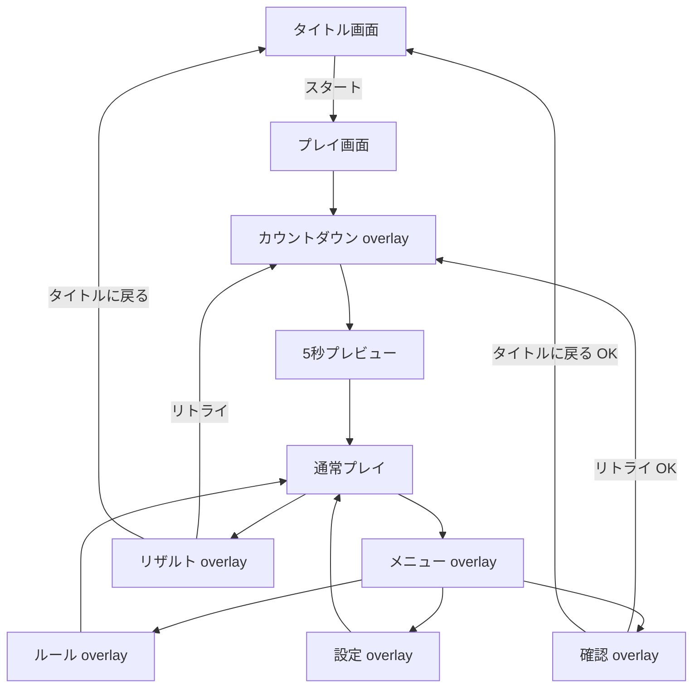

# 画面設計書：プレイ画面

> プロダクト方針: [`docs/PRODUCT_POLICY.md`](../PRODUCT_POLICY.md)

---

## 1. ドキュメント情報

| 項目 | 内容 |
|------|------|
| 画面ID | `play` |
| 画面名 | プレイ画面 |
| 作成日 | `2026-05-31` |
| 更新日 | `2026-06-08` |
| 関連ブランチ | `main` |
| 参照実装 | `src/App.tsx`, `src/StatusBar.tsx`, `src/App.css`, `src/status-bar.css` |

---

## 2. 本画面のスコープ

| 区分 | 内容 |
|------|------|
| **Must（維持・文書化）** | 4×4 カードグリッド / めくり・一致判定 / ポイント・コンボ / 制限時間（30秒） / タイムボーナス（残り秒×10） / ヘッダー / ステータスバー / フッター操作（メニュー・リザルト） / カウントダウンオーバーレイ / 5秒プレビュー / メニュー・確認・リザルト・遊び方・設定モーダル |
| **Must（タイトル連携時の変更）** | タイトル「スタート」からの遷移で本画面を表示。初回マウント時の自動プレビューは **スタート後のみ** 発火するよう調整 |
| **Should（余力があれば）** | `checkFinished` の判定タイミング修正（全 `matched` でクリア判定） |
| **Won't（今回やらない）** | localStorage スコア履歴 / 操作エフェクト強化 / 難易度選択 |

### 2.1 広告・収益（本画面）

| 項目 | 方針 |
|------|------|
| 広告枠の有無 | **あり（推奨）** — フッター下 or 画面最下部にバナー枠 |
| 推奨広告種別 | **バナー**（プレイ中は操作領域と分離） / **インタースティシャル**はリザルト閉じた後（将来・別設計） |
| 表示タイミング | プレイ中はカードグリッドを阻害しない位置。リザルト表示中は広告非表示 or リザルト下 |
| UX上の注意 | カード（4×4）・フッターボタン（⋯🏁）と広告を重ねない |

---

## 3. 画面概要

### 3.1 目的

- **現行実装をベース**とし、タイトル画面追加時は **遷移の接続のみ** 変更する（プレイ・スコア・リザルト仕様は維持）。
- 16枚の神経衰弱をプレイし、ポイント・コンボを稼ぎ、全ペア揃えでクリアする。
- メニュー経由で遊び方・設定・リトライ・タイトル戻り、およびリザルト確認を **画面内完結**で行える。

### 3.2 前提・制約

- カード絵柄: `src/assets/monsters/*.PNG` からランダム 8 種 × 2 枚（計 16 枚）。
- カード裏: `/card-back.png`（`public`）。
- 基本ポイント: `basePoint = 10`。コンボ加算: `basePoint + comboCount * basePoint`。
- プレビュー: リセット／ゲーム開始後 **5秒間** 全カード表向き。
- 画面全体は `100dvh` ベースで viewport 内に収め、スマホでページスクロールを発生させない。
- 制限時間: **30秒**。最初の有効なカードタップ時にタイマーを開始する。

### 3.3 画面遷移



| 遷移元 | トリガー | 遷移先 |
|--------|----------|--------|
| タイトル画面 | スタート | プレイ画面 + `resetGame` シーケンス |
| プレイ画面 | メニュー「リトライ」→確認OK | 同一画面内でカウントダウン→プレビュー→再プレイ |
| プレイ画面 | 全カードクリア | リザルト overlay 自動表示（1秒後） |
| プレイ画面 | 🏁（クリア後またはタイムアップ後に有効） | リザルト overlay 手動表示 |
| プレイ画面 | ⋯ | メニュー overlay |
| メニュー overlay | 遊び方 / 設定 | 各 overlay を表示 |
| メニュー overlay | タイトルに戻る / リトライ | 確認 overlay を表示 |
| リザルト overlay | タイトルに戻る / リトライ | タイトル遷移 or 再プレイ |
| overlay | ❎ | プレイ画面（overlay 閉じる） |

---

## 4. UI構成

### 4.1 レイアウト（ワイヤー）

```
┌─────────────────────────────────┐
│      Match Monster   (header)   │
├─────────────────────────────────┤
│            TIME 30              │  ← 制限時間（ステータスバー上の中央）
├─────────────────────────────────┤
│  POINT: [====]   COMBO: [□□□□] │  ← StatusBar
├─────────────────────────────────┤
│  ┌──┬──┬──┬──┐                  │
│  │  │  │  │  │                  │
│  ├──┼──┼──┼──┤   4×4 カード     │
│  │  │  │  │  │                  │
│  ├──┼──┼──┼──┤                  │
│  │  │  │  │  │                  │
│  └──┴──┴──┴──┘                  │
├─────────────────────────────────┤
│           ⋯    🏁                │  ← footer
├─────────────────────────────────┤
│  [ 広告バナー枠（予約） ]          │
└─────────────────────────────────┘

※ countdown / menu / confirm / result / rules / settings は overlay で全画面覆い
```

### 4.2 コンポーネント一覧

| ID | 種別 | 表示名 | 操作 | 実装ファイル |
|----|------|--------|------|--------------|
| `header` | `header` + `h1` | Match Monster | なし | `App.tsx` |
| `status-bar` | コンポーネント | POINT / COMBO（8段） | なし | `StatusBar.tsx` |
| `card-grid` | `div.grid` | 16枚カード | カードタップでめくる | `App.tsx` |
| `card` | `button.card` | モンスター絵 + 裏面 | `flipCard(i)` | `App.tsx` |
| `timer-bar` | テキスト | TIME / 残り秒（大きめ表示） | 最初のカードタップで開始（ヘッダー直下） | `App.tsx` |
| `btn-menu` | フッター | ⋯ | `openMenu` | `App.tsx` |
| `btn-result` | フッター | 🏁 | `openResult`（`isFinished` または `isTimeOver` 時に有効） | `App.tsx` |
| `app-footer` | 共通 | コピーライト | なし | `AppFooter.tsx` |
| `ad-banner-slot` | コンテナ | （未実装・MVP追加推奨） | なし | 新規 |

### 4.3 モーダル・オーバーレイ

#### カウントダウン（`countdown-overlay`）

| 項目 | 仕様 |
|------|------|
| 表示条件 | `countdown !== null`（`resetGame` 実行時） |
| 表示内容 | `ready...` → `3` → `2` → `1`（各1秒） |
| 閉じ方 | 自動（3秒後に `showCards` へ） |
| 操作中 | `isResetting === true` — カード操作不可 |

#### リザルト（`result-overlay`）

| 項目 | 仕様 |
|------|------|
| 表示条件 | `isViewResult === true`（クリア後自動 or 🏁） |
| 表示内容 | 上段に `MAX COMBO` / `POINT` / `BONUS`（条件で `HISPEED BONUS` 追加）の要約表示、中央に大きな `TOTAL SCORE` と合計値、下段にアクションボタン |
| 補助メッセージ | クリア時 `Excellent!` / `Great!` / `Clear!`、タイムアップ時 `Time Up!` |
| 操作 | `リトライ` / `タイトルに戻る` ボタンを表示 |
| 閉じ方 | ❎ → `closeResult` |

#### メニュー（`menu-overlay`）

| 項目 | 仕様 |
|------|------|
| 表示条件 | `isViewMenu === true`（フッター ⋯） |
| 項目順 | `リトライ` → `遊び方` → `設定` → `タイトルに戻る` |
| 操作 | 遊び方/設定を開く、リトライ/タイトル戻りは確認ダイアログを挟む |
| 閉じ方 | ❎ または overlay 外タップ |

#### 確認（`confirm-overlay`）

| 項目 | 仕様 |
|------|------|
| 表示条件 | `isViewConfirm === true` |
| 表示内容 | 「現在進行中のゲーム内容が失われます。」 |
| OK時 | `confirmAction` が `retry` なら再プレイ、`backToTitle` ならタイトル遷移 |
| キャンセル時 | メニューへ戻る |

#### ルール（`rules-overlay`）

| 項目 | 仕様 |
|------|------|
| 表示条件 | `isViewRules === true` |
| 表示内容 | 5秒プレビュー / ペア / コンボ / 制限時間30秒 / 時間内クリアでタイムボーナス |
| 文字色 | 本文を含めて白（`#fff`） |
| 閉じ方 | ❎ → `closeRules` |

#### 設定（`settings-overlay`）

| 項目 | 仕様 |
|------|------|
| 表示条件 | `isViewSettings === true` |
| 表示内容 | サウンドON/OFF / 効果音スライダー |
| 閉じ方 | ❎ または overlay 外タップ |

---

## 5. 状態・ロジック

### 5.1 画面ステート（React state）

| ステート | 型 | 説明 |
|----------|-----|------|
| `cards` | `Card[]` | 16枚。`flipped` / `matched` / `icon` |
| `selected` | `number[]` | めくった未確定インデックス（最大2） |
| `point` | `number` | 累計ポイント |
| `comboCount` | `number` | 現在コンボ（不一致で0） |
| `maxCombo` | `number` | ゲーム中最大コンボ |
| `timeLeft` | `number` | 残り秒数（30 から開始） |
| `isTimerRunning` | `boolean` | 最初のカードタップ後にタイマー進行中 |
| `isTimeOver` | `boolean` | 制限時間切れ |
| `timeBonus` | `number` | クリア時ボーナス（`timeLeft * 10`） |
| `hiSpeedBonus` | `number` | 早解きボーナス（Excellent: 500 / Great: 100 / Clear: 0） |
| `preResultCue` | `'none' \| 'excellent' \| 'great' \| 'clear' \| 'timeUp'` | リザルト前に中央表示する補助メッセージ種別 |
| `isResetting` | `boolean` | リセット・プレビュー中 |
| `countdown` | `number \| string \| null` | オーバーレイ表示用 |
| `isFinished` | `boolean` | クリア済み |
| `isViewResult` | `boolean` | リザルト表示 |
| `isViewMenu` | `boolean` | メニュー表示 |
| `isViewConfirm` | `boolean` | 確認表示 |
| `confirmAction` | `'none' \| 'backToTitle' \| 'retry'` | 確認対象アクション |
| `returnMenuOnRulesClose` | `boolean` | 遊び方を閉じた後メニューへ戻すか |
| `returnMenuOnSettingsClose` | `boolean` | 設定を閉じた後メニューへ戻すか |
| `isViewRules` | `boolean` | ルール表示 |
| `isViewSettings` | `boolean` | 設定表示 |

**Ref:**

| Ref | 説明 |
|-----|------|
| `shuffledCardsRef` | シャッフル済みカード配列（リセット時に再生成） |

### 5.2 ビジネスルール

#### カード生成（`createShuffledCards`）

1. 全モンスター画像からランダムに **8種** を選択。
2. 各種2枚ずつ複製し、16枚を再シャッフル。
3. `id` は 0〜15 のインデックス。

#### めくり（`flipCard`）

1. `isResetting` / 既に `flipped` or `matched` / `selected.length === 2` のときは無視。
2. 1枚目: `flipped = true`、 `selected` に追加。
3. 2枚目: 同一 `icon` なら一致
   - ポイント: `basePoint + comboCount * basePoint` を加算
   - `comboCount++`、`maxCombo` 更新
   - 600ms 後に `matched = true`
4. 不一致: `comboCount = 0`、600ms 後に両方 `flipped = false`
5. `selected` をクリア

#### 制限時間（`timeLeft`）

1. 初期値は 30 秒。
2. 最初の有効なカードタップ時に `isTimerRunning = true` とし、1秒ごとに減算する。
3. 残り 5 秒以下で表示を赤字にし、毎秒のカウントで発光・拡大する警告エフェクトを再生する。
4. クリア時（タイムアップ前）は `timeBonus = timeLeft * 10` を算出し、リザルトでは `point` とは別に扱う。
5. クリア時の補助メッセージと HiSpeedBonus は経過時間で決定する。
  - 経過 10 秒以内: `Excellent!` / `hiSpeedBonus = 500`
  - 経過 10 秒超過〜20 秒以内: `Great!` / `hiSpeedBonus = 100`
  - 経過 20 秒超過〜30 秒以内: `Clear!` / `hiSpeedBonus = 0`
6. リザルトの `TOTAL` は `point + timeBonus + hiSpeedBonus` で表示する。
7. `HISPEED BONUS` は `hiSpeedBonus > 0` のときのみ表示する。
8. 0 秒到達時はタイムアップ扱いとし、カード操作を停止してリザルトを表示し、`Time Up!` を表示する。
9. リセット / タイトル戻りで `timeLeft = 30`, `timeBonus = 0`, `hiSpeedBonus = 0` に戻す。

#### ゲーム開始 / リセット（`resetGame`）

1. `countdown = 'ready...'`、`isResetting = true`
2. `resetParameter()` — スコア・コンボ・選択・`isFinished` リセット
3. 新しい `shuffledCardsRef` 生成、カードを裏向きに
4. 3, 2, 1 カウント（各1秒）
5. `showCards()` — 5秒全表向き → 裏向き → `isResetting = false`

#### クリア判定（`checkFinished`）— 現行

- 条件: `cards` に `flipped === false` のカードが **ない**
- 満たすと `isFinished = true`、1秒後 `isViewResult = true`

> **既知の注意:** 不一致ペアは一時的に両方 `flipped` になるため、理論上クリア前に誤検知する可能性がある。MVP後 Should で「全 `matched`」判定へ変更推奨。

#### フッター 🏁

- `isFinished === false` かつ `isTimeOver === false` のとき `disabled` クラス（操作不可）

#### メニュー経由の再プレイ / タイトル戻り

- メニューの `リトライ` / `タイトルに戻る` は確認ダイアログを表示。
- リザルトの `リトライ` / `タイトルに戻る` は確認なしで即時実行。

### 5.3 エッジケース

| ケース | 期待動作（現行） |
|--------|------------------|
| リセット中のカードタップ | 無視（`isResetting`） |
| リセット連打 | 1回目のみ（`isResetting` ガード） |
| めくり中に3枚目タップ | 無視（`selected.length === 2`） |
| マッチ済みカードタップ | `disabled` + 早期 return |
| 制限時間切れ後のカードタップ | 無視（`isTimeOver`） |
| タイトルからスタート（新規） | `resetGame` と同シーケンスで開始 |

---

## 6. データ・永続化

| データ | 保存先 | MVP |
|--------|--------|-----|
| カード配置 | メモリ（`shuffledCardsRef`） | 現状維持 |
| スコア・コンボ | メモリ（React state） | 現状維持 |
| ベストスコア | — | ❌ Won't |
| ゲーム設定（音量） | `localStorage`（タイトル画面で管理） | プレイ画面では読み取りのみ（将来 BGM 連携） |

---

## 7. 音声・設定

| 項目 | 仕様 | MVP |
|------|------|-----|
| BGM / SE | 未実装 | プレイ画面からは設定不可（タイトルのみ） |
| 将来 | `useGameSettings` の音量を `<audio>` に反映 | 別タスク |

---

## 8. 非機能要件

| 項目 | 要件 |
|------|------|
| 画像プリロード | マウント時 `allIcons` を `Image()` で先読み（現行維持） |
| viewport / スクロール | `html`, `body`, `#root` を含めて縦スクロールを発生させない。ルートは `100dvh` ベースで管理する |
| フッター余白 | 制限時間表示のため、コピーライト上の余白を必要最小限に圧縮する |
| レスポンシブ | `@media (max-width: 600px)` でカード・フッター調整（`App.css`） |
| CSS 変数 | `--card-width: 70px`, `--card-height: 105px`（`index.css`） |
| タップ | `-webkit-tap-highlight-color: transparent`（カード） |

---

## 9. 受け入れ条件（Acceptance Criteria）

### 現行機能（リグレッション）

- [ ] AC-1: 4×4 の16枚カードが表示され、タップでめくれる
- [ ] AC-2: 一致でポイント加算・コンボ増加、不一致でコンボリセット・裏返し
- [ ] AC-3: メニュー `リトライ`（確認OK）またはリザルト `リトライ` で `ready...` → 3,2,1 → 5秒プレビュー → プレイ可能になる
- [ ] AC-4: 制限時間は 30 秒で、最初の有効なカードタップ時にカウントが開始される
- [ ] AC-5: 残り 5 秒以下でタイマー表示が赤字になり、毎秒のカウントで発光・拡大エフェクトが再生される
- [ ] AC-6: 0 秒到達時にタイムアップ扱いとなり、カード操作が停止してリザルトが表示される
- [ ] AC-7: クリア後、リザルト上段に MAX COMBO / POINT / BONUS（条件で HISPEED BONUS）、中央の主表示として TOTAL SCORE が表示される
- [ ] AC-8: タイムアップ前にクリアした場合、`remainingTime * 10` が BONUS に反映される
- [ ] AC-9: `TOTAL` は常に `POINT + BONUS + HISPEED BONUS` になる
- [ ] AC-10: 0 秒到達時は `Time Up!` が表示され、BONUS は 0 で表示される
- [ ] AC-11: ⋯ でメニュー overlay が開き、`リトライ / 遊び方 / 設定 / タイトルに戻る` が表示される
- [ ] AC-12: メニューの `リトライ` と `タイトルに戻る` は確認 overlay を経由して実行される
- [ ] AC-13: リザルト overlay に `リトライ` / `タイトルに戻る` ボタンが表示され、各動作が実行される
- [ ] AC-14: 遊び方ダイアログ本文が白文字で表示される
- [ ] AC-15: クリア前かつタイムアップ前は 🏁 が無効、クリア後またはタイムアップ後は有効
- [ ] AC-16: クリア時に経過時間に応じて `Excellent!` / `Great!` / `Clear!` が表示される
- [ ] AC-17: `Excellent!` は `HISPEED BONUS = 500`、`Great!` は `HISPEED BONUS = 100`、`Clear!` は `HISPEED BONUS = 0`
- [ ] AC-18: `HISPEED BONUS` は獲得時（0より大きい）にのみ表示される
- [ ] AC-19: フッターに `AppFooter` によるコピーライトが表示される

### タイトル画面連携（新規）

- [ ] AC-20: タイトル「スタート」後のみプレイ画面が表示され、AC-3 の開始シーケンスが走る
- [ ] AC-21: アプリ起動直後にプレイ画面が **単独で** 表示されない（タイトル経由）

### 収益向け（推奨）

- [ ] AC-22: フッター下に広告プレースホルダ枠があり、カード・ボタンと重ならない

---

## 10. 実装メモ

| 項目 | 内容 |
|------|------|
| 現行ファイル | `src/App.tsx`（ロジック集約）, `src/StatusBar.tsx`, `src/App.css`, `src/status-bar.css`, `src/index.css` |
| タイトル連携時の変更 | `App.tsx` に `appScreen` 分岐。初回 `useEffect` での暗黙スタートがあれば削除し、スタート時に `resetGame()` 呼び出し |
| 分割推奨（任意） | `src/screens/PlayScreen.tsx` へ UI 移動。MVPでは `App.tsx` 内分岐でも可 |
| 定数 | `basePoint = 10`、プレビュー `5000ms`、めくり確定 `600ms`、カウント `1000ms` |
| 依存 | 追加パッケージなし |

### Card 型（参照）

```ts
interface Card {
  id: number;
  icon: string;
  flipped: boolean;
  matched: boolean;
}
```

---

## 11. 変更履歴

| 日付 | 変更内容 |
|------|----------|
| 2026-05-31 | 現行 `App.tsx` 実装の文書化。MVP（タイトル連携・広告枠）差分を追記 |
| 2026-06-07 | フッター操作を `⋯/🏁` に更新。メニュー/確認/設定モーダル、リザルト内 `リトライ/タイトルに戻る`、遊び方本文白文字を反映 |
| 2026-06-07 | 100dvh ベースの viewport 固定・スクロール禁止・短い端末向け密度調整を反映 |
| 2026-06-07 | 制限時間 60 秒・初回タップ開始・残り 5 秒の警告表示を反映 |
| 2026-06-07 | タイマーをヘッダー直下へ配置。TIME 文字拡大、`Time Bonus!`/`Time Up!` 表示、`timeLeft * 10` のボーナス加算を反映 |
| 2026-06-07 | リザルトを `POINT` と `BONUS` 分離 + `TOTAL` 追加に変更。`Time Bonus!`/`Time Up!` の事前表示時間を延長 |
| 2026-06-07 | リザルトを「結果一覧」から「TOTAL SCORE を祝福する画面」へ再設計。TOTAL SCORE を中央の主役に変更 |
| 2026-06-08 | クリア時補助メッセージを `Excellent!`/`Great!`/`Clear!` に変更。`HISPEED BONUS`（500/100/0）を導入し、`TOTAL = POINT + BONUS + HISPEED BONUS` へ更新 |
| 2026-06-08 | 🏁 ボタンをタイムアップ後にも有効化。リザルトの `HISPEED BONUS` は獲得時のみ表示へ更新 |
