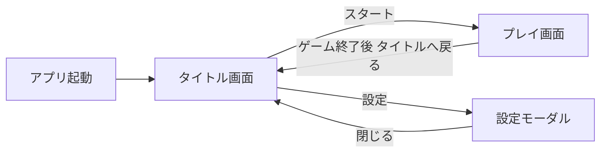

# 画面設計書：タイトル画面

> プロダクト方針: [`docs/PRODUCT_POLICY.md`](../PRODUCT_POLICY.md)

---

## 1. ドキュメント情報

| 項目 | 内容 |
|------|------|
| 画面ID | `title` |
| 画面名 | タイトル画面 |
| 版 | `0.1.0` |
| 作成日 | `2026-05-31` |
| 更新日 | `2026-05-31` |
| 関連ブランチ | `feature/add-title-page` |
| 参照実装 | 未実装（新規） / 既存 `src/App.tsx` から遷移先を分離予定 |

---

## 2. 本画面のスコープ

| 区分 | 内容 |
|------|------|
| **Must（今回実装）** | ゲームタイトル表示 / スタートボタン / 設定ボタン（音量：マスターON-OFF＋音量スライダー） |
| **Should（余力があれば）** | バージョン表記（`ver1.1.1` 右下・小さく） |
| **Won't（今回やらない）** | ベストスコア表示（localStorage） / ルールボタン（プレイ画面フッターで代替） / クレジット / 難易度選択 / 言語切替 / 続きから / アニメーション付きロゴ / SNSシェア |

### 2.1 広告・収益（本画面）

| 項目 | 方針 |
|------|------|
| 広告枠の有無 | **あり（推奨）** — 画面下部にバナー用プレースホルダ領域を確保 |
| 推奨広告種別 | **バナー**（常時 or タイトル表示中） |
| 表示タイミング | タイトル表示中。スタート押下後はプレイ画面へ遷移し、バナーはプレイ画面下部へ移す or 非表示（実装時に広告SDK仕様に合わせる） |
| UX上の注意 | スタート・設定ボタンと広告枠を離し、誤タップを防ぐ。設定モーダル表示中は広告の上にモーダルを重ねる |

---

## 3. 画面概要

### 3.1 目的

- 起動直後に本画面を表示し、ユーザーが **スタート** してからプレイ画面へ誘導する。
- **音量設定**をプレイ前に完了させ、ゲーム中の設定変更を減らす。
- 静止画面として **広告バナー枠** を確保しやすくする（収益用プレースホルダ）。
- 初回・再訪問ユーザーにゲーム名（Match Monster）を認知させる。

### 3.2 前提・制約

- 既存タイトル文言 **「Match Monster」** を使用（`App.tsx` ヘッダーと統一）。
- 配色は既存 `--background: #800020`、アクセント `#B38600` を踏襲（`index.css` / `App.css`）。
- 新規画面でも **追加 npm パッケージは原則なし**（音量は Web Audio API または `<audio>` + `localStorage`）。
- **UI 共通:** [`UI_COMMON.md`](UI_COMMON.md) — 画面下部に `AppFooter`（コピーライト Must）。

### 3.3 画面遷移



| 遷移元 | トリガー | 遷移先 |
|--------|----------|--------|
| アプリ起動 | 初回マウント | タイトル画面 |
| タイトル画面 | スタートボタン | プレイ画面（既存 `resetGame` 相当の開始シーケンス） |
| プレイ画面 | （将来）タイトルへ戻る導線 | タイトル画面 ※MVPでは未実装可。リセット🔁で再プレイ継続 |

**MVPの遷移方針:** スタート → プレイ画面のみ必須。プレイ → タイトルへの戻りは **Won't**（次フェーズ）。リリース速度優先。

---

## 4. UI構成

### 4.1 レイアウト（ワイヤー）

```
┌─────────────────────────────────┐
│                                 │
│        Match Monster            │  ← ゲームタイトル（Must）
│     （任意: サブコピーなし）       │
│                                 │
│         [ スタート ]             │  ← Must
│         [  設定 ⚙  ]            │  ← Must
│                                 │
│                                 │
│  ┌─────────────────────────┐   │
│  │   広告バナー枠（予約）    │   │  ← 収益用プレースホルダ
│  └─────────────────────────┘   │
│      © 2026 A型システム         │  ← AppFooter（Must）
│                      ver 1.1.1  │  ← Should
└─────────────────────────────────┘
```

### 4.2 コンポーネント一覧

| ID | 種別 | 表示名 / ラベル | 操作 | Must |
|----|------|-----------------|------|------|
| `title-logo` | テキスト（`h1`） | Match Monster | なし | ✅ |
| `btn-start` | ボタン | スタート / START | タップでプレイ画面へ | ✅ |
| `btn-settings` | ボタン | 設定（⚙ アイコン or 文言） | タップで設定モーダル表示 | ✅ |
| `ad-banner-slot` | コンテナ（`div`） | （広告SDK差し込み用・高さ固定） | なし | ✅（枠のみ。SDK連携は別タスク可） |
| `app-footer` | 共通 [`AppFooter`](../../src/components/AppFooter.tsx) | コピーライト | なし | ✅ |
| `version-label` | テキスト | ver 1.1.1 | なし | △ Should |

### 4.3 モーダル・オーバーレイ

#### 設定モーダル（`settings-modal`）

| ID | 種別 | 表示名 | 操作 | Must |
|----|------|--------|------|------|
| `settings-overlay` | オーバーレイ | 半透明背景 | 外側タップ or ❎ で閉じる | ✅ |
| `vol-master-toggle` | トグル or チェック | サウンド ON / OFF | マスター音量 0 / 復元 | ✅ |
| `vol-slider` | range input | 音量 | 0〜100%。OFF時は無効化 | ✅ |
| `btn-settings-close` | ボタン | ❎ | モーダルを閉じる | ✅ |

**音量仕様（MVP）:**

- **マスター1本**（BGM / SE の分離は Won't。将来 SE 追加時に拡張）。
- 設定値は `localStorage` に保存（キー例: `match-monster-settings`）。
- 初回訪問: サウンド ON、音量 70%（仮。実装時に調整可）。

```
┌──────────────────────────┐
│        設定               │
│  ─────────────────────   │
│  サウンド  [ ON / OFF ]   │
│  音量      [━━━━●──]      │
│                          │
│            [ ❎ ]        │
└──────────────────────────┘
```

---

## 5. 状態・ロジック

### 5.1 画面ステート

| ステート名 | 説明 | 遷移条件 |
|------------|------|----------|
| `title` | タイトル表示中 | 初期状態 |
| `settings-open` | 設定モーダル表示中 | 設定ボタン押下 |
| `transitioning-to-play` | プレイ画面へ切替中 | スタート押下（即時遷移） |

**アプリ全体の画面ステート（新規）:**

```ts
type AppScreen = 'title' | 'play';
```

| `appScreen` | 表示内容 |
|-------------|----------|
| `title` | タイトル画面コンポーネント |
| `play` | 既存プレイ UI（`App.tsx` から分離推奨） |

### 5.2 ビジネスルール

1. **初回アクセス時は必ずタイトル画面**を表示する（プレイ画面を直接出さない）。
2. **スタート**押下で `appScreen = 'play'` とし、既存のゲーム開始シーケンスを実行する。
   - 既存 `resetGame()` と同等: `ready...` → 3, 2, 1 カウントダウン → 5秒プレビュー → プレイ可能。
3. **設定**はタイトル・プレイの両方から開ける必要はない（**タイトルのみ Must**）。プレイ中の音量変更は Won't（リリース後要望があれば追加）。
4. 画像プリロード（既存 `useEffect`）は **アプリ起動時**に実行し、スタート後の待ち時間を短くする。

### 5.3 エッジケース

| ケース | 期待動作 |
|--------|----------|
| スタート連打 | 1回のみ遷移。二重遷移しない |
| 設定表示中にスタート | 設定を閉じてからスタート、またはスタート無効（どちらか一方に統一。推奨: モーダル閉じてから） |
| localStorage 読み込み失敗 | デフォルト音量で起動 |
| 音声ファイル未配置（MVP） | 音量 UI のみ実装し、実音源は次フェーズでも可。UI と保存ロジックは先行実装 |

---

## 6. データ・永続化

| データ | 保存先 | キー例 | MVP |
|--------|--------|--------|-----|
| マスター音量 ON/OFF | `localStorage` | `match-monster-settings.soundEnabled` | ✅ |
| 音量値 0–100 | `localStorage` | `match-monster-settings.volume` | ✅ |
| ベストスコア | — | — | ❌ Won't |
| 初回訪問フラグ | — | — | ❌ 不要（常にタイトル表示でよい） |

**JSON 例:**

```json
{
  "soundEnabled": true,
  "volume": 70
}
```

---

## 7. 音声・設定

| 項目 | 仕様 | MVP |
|------|------|-----|
| BGM | 未実装でも設定 UI は用意。ON/OFF・スライダーは `localStorage` に反映 | UI ✅ / 再生 △（音源なしでも可） |
| SE | カードめくり等は Won't | ❌ |
| 設定の保存 | 変更時に即 `localStorage` 保存 | ✅ |

---

## 8. 非機能要件

| 項目 | 要件 |
|------|------|
| 初回表示 | タイトル＋ボタンが 1 秒以内に操作可能（画像プリロードはバックグラウンド） |
| パフォーマンス | 既存モンスター画像プリロードを維持 |
| アクセシビリティ | スタート・設定は `button`、`aria-label` 付与 |
| 対応ブラウザ | iOS Safari / Android Chrome を優先 |

---

## 9. 受け入れ条件（Acceptance Criteria）

- [ ] AC-1: アプリ起動時、プレイ画面ではなくタイトル画面が表示される
- [ ] AC-2: 「Match Monster」タイトルが表示される
- [ ] AC-3: スタートボタンでプレイ画面に遷移し、既存どおりカウントダウン→5秒プレビュー後にプレイできる
- [ ] AC-4: 設定ボタンで設定モーダルが開き、サウンド ON/OFF と音量スライダーが操作できる
- [ ] AC-5: 音量設定が `localStorage` に保存され、再読み込み後も反映される
- [ ] AC-6: 広告バナー用のプレースホルダ領域がレイアウト上確保されている（SDK未連携でも DOM 枠は存在）
- [ ] AC-7: スマホ幅（600px 以下）でボタンが画面内に収まり、誤タップしにくい間隔がある
- [ ] AC-8: 画面下部に `AppFooter` によるコピーライトが表示される

---

## 10. 実装メモ

| 項目 | 内容 |
|------|------|
| 想定ファイル | `src/screens/TitleScreen.tsx`, `src/components/SettingsModal.tsx`, `src/hooks/useGameSettings.ts`（または同等）, `src/App.tsx` で `appScreen` 分岐 |
| 想定スタイル | `src/screens/title-screen.css`（既存配色変数を流用） |
| 既存流用 | `resetGame` / `showCards` ロジックはプレイ画面側に残し、スタート時に呼び出す |
| 依存ライブラリ | 追加なし |
| 広告 SDK | AdSense 等は **別タスク**。本画面は `ad-banner-slot` のみ先行 |

---

## 11. 変更履歴

| 版 | 日付 | 変更内容 |
|----|------|----------|
| 0.1.0 | 2026-05-31 | MVP 向け初版（広告収益優先・最小機能） |
